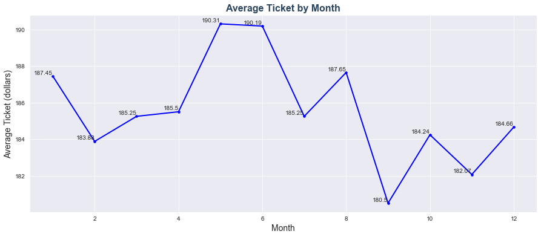
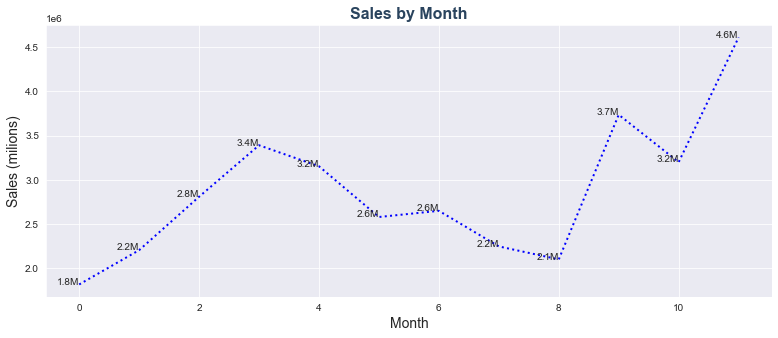
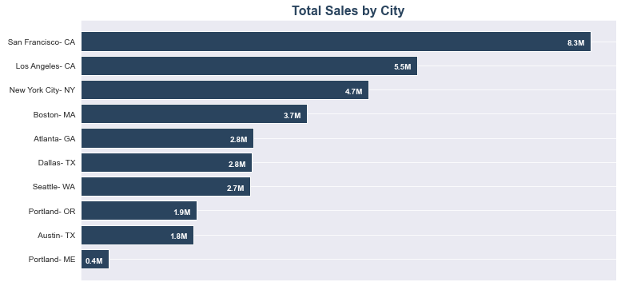
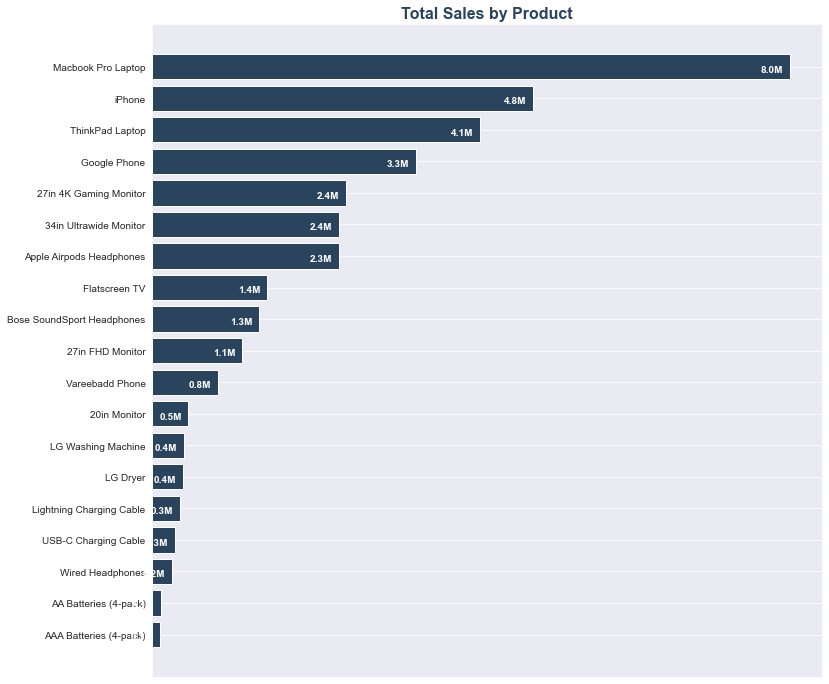
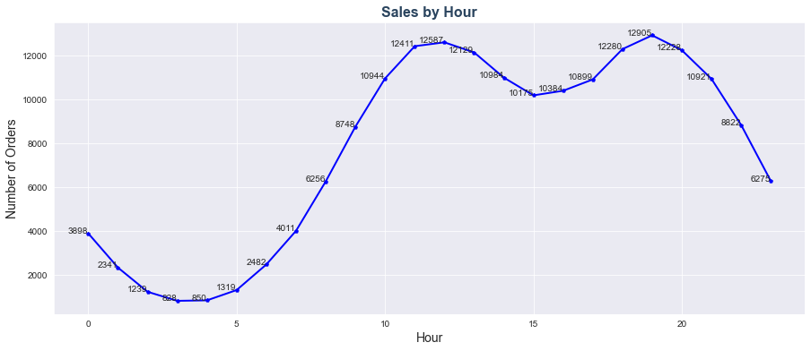

# Exploratory Data Analysis - Sales Product

**Data Analyst:** Amanda Barbosa

## Business Problem

Tech Store is an e-commerce based in the United States which opened in 2019. As the year ended, Tech Store's director of sales requested a year-end closing report.

The data analyst was requested to respond to the following questions in order to write the report.

-  What is the average ticket by month?
-  How were the sales throughout the year?
-  Which location had the highest sales?
-  What products are most often sold?
-  What products are most often sold together?
-  What time should we display adverstisement to maximize likelihood of customer's buying product?

## Data Preprocessing

In this first step, data was imported and verified, with the following actions:

- Merge the 12 months of sales data into a single CSV file;
- Check and remove NaN and incorrect rows;
- Check and change data types from the columns 'Order Date', 'Quantity Ordered' and 'Price Each';
- Spliting Columns (Order Date and Purchase Address);
- Create 'Sales' column by multiplying 'Price Each' and 'Quantity Ordered';
- Drop 2020 year rows, because our intention is only to analyse the year 2019.

## Data Analysis

### 1 - What is the average ticket by month?

**Results:** The average ticket amount for the year was 185.00, with the highest values in the months of May and June, at around 190.00.

### 2 - How were the sales throughout the year?

**Results:** Although the year ended with a significant increase compared to the beginning of the period, sales were unstable throughout 2019, showing periods of sales increase followed by long periods of decline.

We can observe an increase in sales of around 23.2% per month in the period from January to April 2019. The months of May and September are followed by constant declines, especially in June (-18.2%) and August (-15.2%). The month of October showed a significant growth of 78.1%, with revenues rising from 2.1M to 3.7M. November presented a new drop of 14.4%, closing the year with the highest turnover of the year at 4.6M.

**Recommendation:** Investigate the cause of the extended sales decreases. As we only have one year's worth of information collected, we cannot yet say whether this pattern will repeat itself in the coming years.

### 3 - Which location had the highest number of sales?

**Results:** The state of California represents the largest share of sales, with about 40% of the total. San Francisco reached 24% of sales, even though it has a population that represents 4.7% of the analyzed cities, followed by Los Angeles with 16% of sales.

New York, which has the largest population among those analyzed, reached 13.5% of sales, followed by Boston with 10.6%. Portland, Maine, represents only 1.3% of sales, but it is the smallest city among those analyzed, with an estimated population of 68 thousand inhabitants.

**Recommendation:** Reinforce marketing in New York, which has a very large potential market and could be further explored, considering the number of inhabitants, and purchasing power.

### 4 - What products are most often sold?

**Results:** Almost half of all sales are concentrated in the three most expensive products: the MacBook Pro laptop (23.3%), the iPhone (13.9%), and the ThinkPad laptop (12.3%). An average of 5200 units of each product were sold.

In terms of units sold, the largest quantities were cables, wired headphones, and batteries, at around 25,000 units each. These goods sold in large quantities because they were the least expensive.

### 5 - What products are most often sold together?

**Results:** The top 5 best-selling products together are cell phones with chargers or headphones, which account for about 40% of sales.

**Recommendation:** Implement marketing campaigns for these items at the same time, with the option of recommending group purchases of products on the website.

| Products Sold together                | Quantity      | % Quantity  |
| ------------------------------------- | ------------- |-------------|
| iPhone, Lightning Charging Cable      | 1004          | 12.7        |
| Google Phone, USB-C Charging Cable    | 987           | 12.5        |
| iPhone, Wired Headphones              | 447           | 5.7         |
| Google Phone, Wired Headphones        | 414           | 5.2         |
| Vareebadd Phone, USB-C Charging Cable | 361           | 4.6         |

### 6 - What time should we display adverstisement to maximize likelihood of customer's buying product?

**Results:** More than 60% of sales are concentrated between 11 a.m. and 8 p.m., with the peak of sales occurring at 7 p.m., accounting for 7% of sales. 

**Recommendation:** This early evening time is the most recommended time for advertising.

## Conclusions

According to the data analyzed, we can see that most sales are concentrated in the state of California (40%), which despite having a much smaller population than New York, has a much greater purchasing power compared to other locations. It is recommended to intensify marketing campaigns in this region, especially for Apple products, which can result in a higher sales value.

The products that are best sold together are cell phones and their accessories. It is recommended to intensify the simultaneous announcement of these products.

We observed that sales throughout the year had considerable fluctuations, even having closed the year with a positive leap. A more accurate investigation is recommended to understand the reason for this behavior, especially in the period from May to September.

## References

* Dataset and variables meaning from <a href="https://www.kaggle.com/datasets/knightbearr/sales-product-data">Kaggle</a>

* Per Capita Personal Income of US cities:  <a href="https://www.census.gov/quickfacts/fact/table/portlandcitymaine,bostoncitymassachusetts/HSG010221">Census</a> and <a href="https://en.wikipedia.org/wiki/List_of_U.S._cities_by_adjusted_per_capita_personal_income">Wikipedia</a>

* List of US cities by <a href="https://en.wikipedia.org/wiki/List_of_United_States_cities_by_population">population</a>

* <a href="https://www.freepik.com/free-photo/young-lady-use-cellphone-order-online-shopping-product-paying-bills-with-banking-app-with-transaction-successful-stay-house-quarantine-activity-fun-activity-coronavirus-prevention_17612639.htm#query=ecommerce&position=24&from_view=search&track=sph">Image by tirachardz</a> on Freepik
